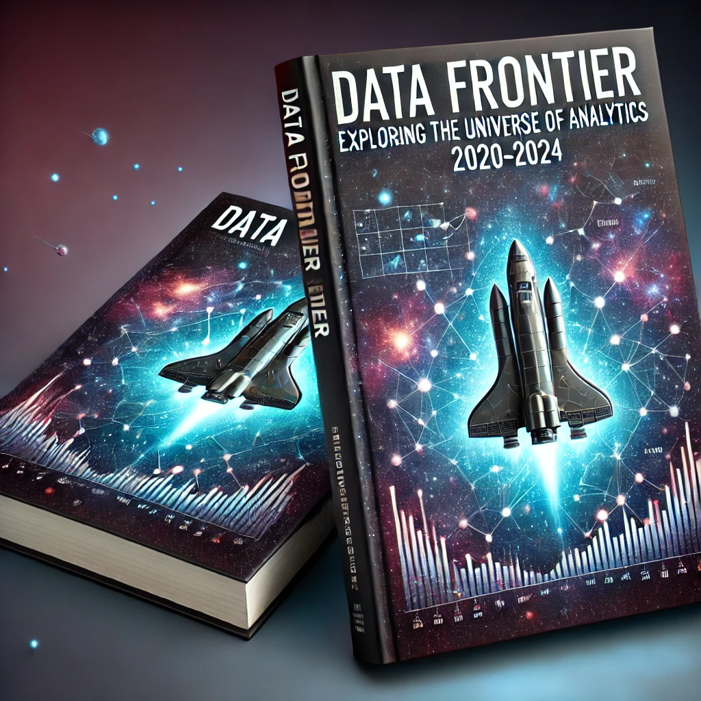

  

# 🚀 **Data Frontier: Explorando o Universo da Análise de Dados (2020-2024)** 🌌

## 🌟 **Introdução: A Nova Fronteira da Análise de Dados**
De 2020 a 2024, a análise de dados evoluiu de forma acelerada, impulsionada por inovações tecnológicas e a demanda crescente por insights baseados em informações. 
Assim como os exploradores de Star Trek, os analistas de dados embarcaram em uma missão para desbravar o universo de possibilidades oferecido por dados complexos.

---

## 📅 **2020: O Início da Jornada**
O ano de 2020 marcou o início de uma nova era na análise de dados. A pandemia de COVID-19 destacou a importância dos dados em tempo real. 
Governos e empresas usaram análises preditivas para tomar decisões rápidas, reconhecendo a análise de dados como uma ferramenta essencial para superar desafios globais.

---

## 🤖 **O Crescimento da Automação e da IA**
Entre 2021 e 2022, tecnologias como aprendizado de máquina e inteligência artificial transformaram a análise de dados. 
Modelos preditivos e prescritivos começaram a não apenas entender tendências, mas também recomendar ações futuras, criando um novo paradigma na exploração de informações.

---

## 🌍 **2022: A Democratização da Análise de Dados**
A partir de 2022, ferramentas de baixo código como **Power BI** e **Tableau** tornaram a análise de dados acessível a um público mais amplo. 
Linguagens como **Python** e **R** consolidaram-se como padrões da indústria, permitindo que mais pessoas extraíssem insights valiosos.

---

## ⚖️ **Os Desafios Éticos na Análise de Dados**
Com grandes poderes vêm grandes responsabilidades. A privacidade dos dados e o viés algorítmico tornaram-se temas cruciais. 
Regulamentações como a **LGPD** no Brasil e o **GDPR** na Europa exigiram transparência e ética em todas as práticas analíticas.

---

## 📈 **A Revolução no Setor de Negócios**
Entre 2023 e 2024, a análise de dados tornou-se um catalisador de transformação nos negócios. Empresas adotaram estratégias baseadas em dados para prever tendências de mercado, 
personalizar experiências e otimizar operações. Big Data combinado com IA revolucionou o setor empresarial.

---

## 🌌 **Ciência de Dados: Explorando Novos Universos**
A ciência de dados explorou novas fronteiras em saúde, sustentabilidade e até exploração espacial. 
Pesquisas médicas usaram IA para entender dados genéticos, enquanto cientistas ambientais monitoraram mudanças climáticas, expandindo os limites conhecidos.

---

## 🔮 **O Futuro da Análise de Dados**
Com tecnologias como computação quântica e IoT, o futuro da análise de dados promete possibilidades inimagináveis. 🚀 O fluxo contínuo de informações 
e a capacidade de processar grandes volumes em alta velocidade transformarão ainda mais o universo da análise de dados.

---

## 🧠 **As Habilidades do Explorador de Dados**
De 2020 a 2024, ficou claro que o sucesso na análise de dados requer mais do que conhecimento técnico. Habilidades como pensamento crítico, 
comunicação e ética são indispensáveis. Transformar números em histórias tornou-se a chave para decisões estratégicas.

---

## 🌟 **Conclusão: Explorando o Infinito e Além**
A jornada da análise de dados de 2020 a 2024 é apenas o começo. Assim como em Star Trek, onde cada missão busca desvendar os mistérios do universo, 
a análise de dados continuará a moldar o futuro, conectando inovação, ética e progresso. 

**Que os dados estejam sempre a seu favor!** 🚀✨
